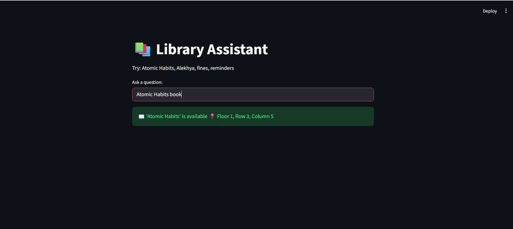

# 📚 LLM Library Assistant (LibroGenie)


---

## 📌 Overview

LibroGenie is an AI-powered intelligent library assistant built using **Generative AI and LangChain**.
It enables users to interact with a library system using natural language to search books, get recommendations, calculate fines, and receive due-date reminders.

This project demonstrates the integration of **Large Language Models (LLMs)** with tool-based reasoning to simulate a real-world AI assistant.

---

## 🎯 Key Highlights

* 🔹 Built using **LangChain Agents + Tool-based architecture**
* 🔹 Integrates **LLM reasoning with structured functions**
* 🔹 Designed for **real-world library management use cases**
* 🔹 Supports both **Demo Mode (offline)** and **Real-time AI Mode**

---

## 🧠 Features

### 📖 Book Search

Retrieve availability and exact location of books in the library

### 🤖 Personalized Recommendations

Suggest books based on user interests

### 💰 Fine Calculation

Automatically compute overdue fines

### ⏰ Due Date Reminders

Notify users about upcoming deadlines

### 💬 Natural Language Interaction

Ask questions like:

* "Where is Atomic Habits?"
* "Suggest books for Alekhya"
* "What are my fines?"

---

## ⚙️ Tech Stack

| Category      | Technology    |
| ------------- | ------------- |
| Language      | Python        |
| Framework     | Streamlit     |
| AI/LLM        | Google Gemini |
| Orchestration | LangChain     |
| Environment   | Python-dotenv |

---

## 🏗️ System Design

The application follows a **tool-based agent architecture**:

User Query → Agent → Tool Selection → Execution → Response

### 🔧 Tools Implemented:

* SearchBooksTool
* GetRecommendations
* CalculateFine
* GetDueReminders

---

## ▶️ How to Run

### 1️⃣ Install dependencies

```bash
pip install -r requirements.txt
```

### 2️⃣ Run application

```bash
streamlit run app.py
```

### 3️⃣ Open in browser

```
http://localhost:8501
```

---

## 📸 Sample Queries & Output (Demo)

### 🔍 Query: Where is Atomic Habits?



---

### 🤖 Query: Suggest books for Alekhya

📌 Recommendations:

* Atomic Habits by James Clear
* Sapiens by Yuval Noah Harari

---

### 💰 Query: What are Alekhya's fines?

💰 Fine Details:
Sapiens → ₹25
Total: ₹25

---

## 🧪 Demo Mode

This project includes a **demo mode** that works without API integration.
It showcases system functionality and logic for evaluation purposes.

---

## 🔑 Real-Time AI Mode (Optional)

To enable real-time AI responses:

1. Get API key from Google AI Studio
2. Create a `.env` file
3. Add:

```env
GOOGLE_API_KEY=your_api_key_here
```

---

## 🚀 Future Enhancements

* 📊 Database integration for real users
* 🌐 Cloud deployment
* 🔐 User authentication
* 📡 Integration with real library APIs

---

## 📌 Learning Outcomes

* Implemented **LLM-based agent architecture**
* Built **tool-based reasoning system using LangChain**
* Designed a **real-world AI assistant application**
* Integrated **frontend with AI backend**

---

## 👩‍💻 Author

Vyshnavi
